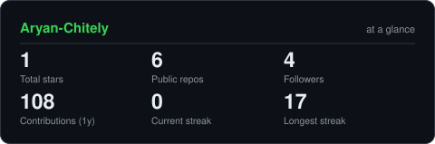
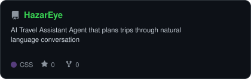
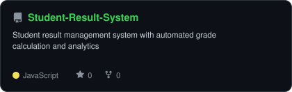
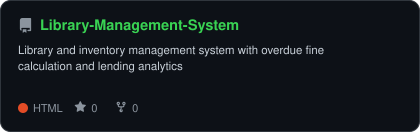

<div align="center">


<br>

<a href="https://github.com/Aryan-Chitely">
  
</a>

<br>

<a href="https://instagram.com/aryann_0318"></a>
<a href="https://www.linkedin.com/in/aryan-chitely-ab8026236"></a>
<a href="mailto:aryanchitely8@gmail.com"></a>
<a href="https://leetcode.com/u/kv7XUWmMh6/"></a>


</div>

---

## `~/` whoami

```console
$ cat about.txt
```

Hi, I'm **Aryan Chitely**. Aspiring software developer working on end-to-end projects
with a focus on clean architecture, problem-solving, and real-world usability.

- Interested in building scalable applications and improving backend logic, data handling, and system design
- Currently sharpening skills in **DSA, backend development**, and writing maintainable, efficient code
- Solved **50+ problems** on LeetCode and HackerRank
- Fun fact: **I believe debugging teaches more than coding — bugs show up exactly when you think you're done.**

<br>

<div align="center">

## `~/` toolbox


</div>

---

<div align="center">

## `~/` skill radar

<table>
<tr>
<td width="50%" align="center" valign="middle">
<picture>
  <source media="(prefers-color-scheme: dark)"  srcset="assets/radar-dark.svg">
  <source media="(prefers-color-scheme: light)" srcset="assets/radar-light.svg">
  
</picture>
</td>
<td width="50%" align="center" valign="middle">
<picture>
  <source media="(prefers-color-scheme: dark)"  srcset="assets/radar-langs-dark.svg">
  <source media="(prefers-color-scheme: light)" srcset="assets/radar-langs-light.svg">
  
</picture>
</td>
</tr>
</table>

</div>

---

<div align="center">

## `~/` contribution calendar


<br><br>

<picture>
  <source media="(prefers-color-scheme: dark)"  srcset="https://raw.githubusercontent.com/Aryan-Chitely/Aryan-Chitely/output/github-snake-red.svg">
  <source media="(prefers-color-scheme: light)" srcset="https://raw.githubusercontent.com/Aryan-Chitely/Aryan-Chitely/output/github-snake-red.svg">
  
</picture>

</div>

---

<div align="center">

## `~/` the numbers

<picture>
  <source media="(prefers-color-scheme: dark)"  srcset="assets/card-stats-dark.svg">
  <source media="(prefers-color-scheme: light)" srcset="assets/card-stats-light.svg">
  
</picture>

<br>


<br><br>


</div>

---

<div align="center">

## `~/` selected work

<table>
<tr>
<td width="50%">
  <a href="https://github.com/Aryan-Chitely/HazarEye">
    <picture>
      <source media="(prefers-color-scheme: dark)"  srcset="assets/card-HazarEye-dark.svg">
      <source media="(prefers-color-scheme: light)" srcset="assets/card-HazarEye-light.svg">
      
    </picture>
  </a>
</td>
<td width="50%">
  <a href="https://github.com/Aryan-Chitely/Student-Result-System">
    <picture>
      <source media="(prefers-color-scheme: dark)"  srcset="assets/card-Student-Result-System-dark.svg">
      <source media="(prefers-color-scheme: light)" srcset="assets/card-Student-Result-System-light.svg">
      
    </picture>
  </a>
</td>
</tr>
<tr>
<td width="50%">
  <a href="https://github.com/Aryan-Chitely/Library-Management-System">
    <picture>
      <source media="(prefers-color-scheme: dark)"  srcset="assets/card-Library-Management-System-dark.svg">
      <source media="(prefers-color-scheme: light)" srcset="assets/card-Library-Management-System-light.svg">
      
    </picture>
  </a>
</td>
<td width="50%"></td>
</tr>
</table>

<sub>

| project | description |
|---|---|
| **[HazarEye](https://github.com/Aryan-Chitely/HazarEye)** | AI Travel Assistant Agent — plans trips through natural language conversation |
| **[Student-Result-System](https://github.com/Aryan-Chitely/Student-Result-System)** | Student result management system with automated grade calculation and analytics |
| **[Library-Management-System](https://github.com/Aryan-Chitely/Library-Management-System)** | Library and inventory management system with overdue fine calculation and lending analytics |

</sub>

</div>

---

<div align="center">
<sub>`01100001 01110010 01111001 01100001 01101110`</sub>
</div>
